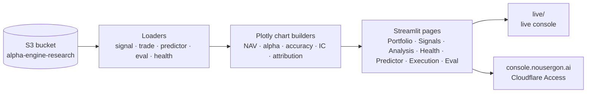

# alpha-engine-dashboard

> Part of [**Nous Ergon**](https://nousergon.ai) — Autonomous Multi-Agent Trading System. Repo and S3 names use the underlying project name `alpha-engine`.

Read-only Streamlit dashboard for monitoring the full Alpha Engine system. Powers the public [`nousergon.ai`](https://nousergon.ai) home page (transitional — moving to `live.nousergon.ai` once the Astro marketing site lands at apex) and the private `console.nousergon.ai` (Cloudflare Access). Reads from S3 only — never writes.

> System overview, Step Function orchestration, and module relationships live in [`alpha-engine-docs`](https://github.com/cipher813/alpha-engine-docs). Code index lives in [`OVERVIEW.md`](OVERVIEW.md).

## What this does

- **Portfolio + alpha** — NAV vs SPY, daily / cumulative alpha, drawdown, position-level P&L attribution
- **Signals + research** — daily signal table, rolling signal accuracy at 10d / 30d, per-ticker thesis timeline
- **Predictor monitoring** — meta-ensemble predictions (UP / FLAT / DOWN), L2 IC trend, per-L1 component IC
- **System health** — last-run timestamps for the three Step Functions (weekly, weekday, EOD), deploy cadence, test surface trend
- **Execution evaluation** — fill quality, entry-trigger distribution, sizing decisions, intraday slippage
- **LLM-as-judge eval quality** — rubric scores over time per agent
- **Three-surface split** — `marketing/` (Astro static site, target apex `nousergon.ai`, scaffold landed 2026-05-21 not yet at apex); `live/` (Streamlit live console, currently at nousergon.ai, moving to `live.nousergon.ai` when marketing flips to apex); the multipage Streamlit app at the repo root powers the private interview-demo dashboard at `console.nousergon.ai`

## Phase 2 measurement contribution

The dashboard is the view layer for everything every other module measures — but it's deliberately a *view*, never a measurement layer. Every chart sources from an existing module's output (research.db, predictions JSON, eod_pnl.csv, backtest reports, judge eval artifacts); no metric is computed ad-hoc in dashboard loaders. If a metric you want isn't already produced upstream, ship it upstream first. This discipline keeps the dashboard's claims aligned with the system's actual measurement substrate.

## Architecture

TTL caching: 15 min for signals + trades, 1 hr for research + backtest. Deployed on EC2 (port 8501 console / port 8502 live); the `live/` Streamlit app fronts the public live console and the multipage app fronts the private dashboard.

## Configuration

This repo is **public**. Bucket names + email recipients in `config.yaml` are gitignored locally; defaults live in `config.yaml.example`. Architecture and approach are public; specific values are private.

## Sister repos

| Module | Repo |
|---|---|
| Executor | [`alpha-engine`](https://github.com/cipher813/alpha-engine) |
| Data | [`alpha-engine-data`](https://github.com/cipher813/alpha-engine-data) |
| Research | [`alpha-engine-research`](https://github.com/cipher813/alpha-engine-research) |
| Predictor | [`alpha-engine-predictor`](https://github.com/cipher813/alpha-engine-predictor) |
| Backtester | [`alpha-engine-backtester`](https://github.com/cipher813/alpha-engine-backtester) |
| Library | [`alpha-engine-lib`](https://github.com/cipher813/alpha-engine-lib) |
| Docs | [`alpha-engine-docs`](https://github.com/cipher813/alpha-engine-docs) |

## License

MIT — see [LICENSE](LICENSE).
